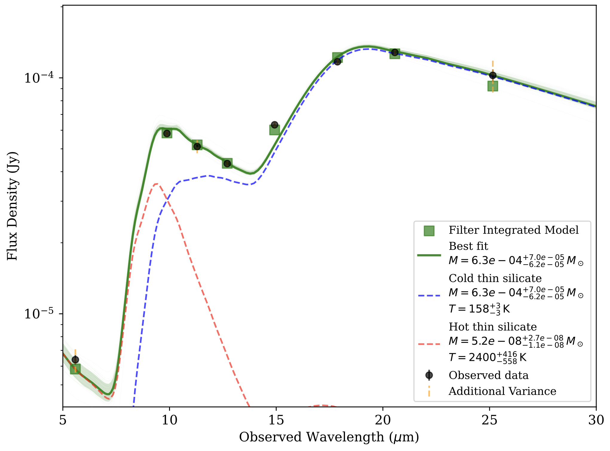

# dustysn

<p align="center">
  
</p>

`dustysn` is a Python package designed to fit the SEDs of supernovae with dust models.

* Documentation: [https://dustysn.readthedocs.io/](https://dustysn.readthedocs.io/)
* Code: [https://github.com/gmzsebastian/dustysn](https://github.com/gmzsebastian/dustysn)
* License: MIT


[](https://coveralls.io/github/gmzsebastian/dustysn?branch=main)
[](https://doi.org/10.5281/zenodo.17807366)

## Quick Start

The simplest way to use `dustysn` is:

```python
import dustysn 
```

<p align="center">
  
  <br>
  <em>Example output for a Supernova.</em>
</p>

## Installation

Install using pip:
```bash
pip install dustysn
```

Or install from source:
```bash
git clone https://github.com/gmzsebastian/dustysn.git
cd dustysn
pip install -e .
```

## Requirements

* Python 3.7 or later
* Having the ``emcee``, ``corner``, and ``astropy`` packages installed

## Citation

If you use `dustysn` in your research, please cite:

```bibtex
@software{2024zndo..12706201G,
       author = {Gomez, Sebastian and Temim, Tea and Shahbandeh, Melissa and Fox, Ori and Moore, Thomas},
        title = "{gmzsebastian/dustysn: dustysn Version 0.2}",
         year = 2025,
        month = dec,
          eid = {10.5281/zenodo.17807366},
          doi = {10.5281/zenodo.17807366},
      version = {v0.2},
    publisher = {Zenodo},
       adsurl = {https://ui.adsabs.harvard.edu/abs/2024zndo..17807366G},
      adsnote = {Provided by the SAO/NASA Astrophysics Data System}
}
```

## License

Copyright 2025 Sebastian Gomez and contributors.

`dustysn` is free software made available under the MIT License. For details see the LICENSE file.
