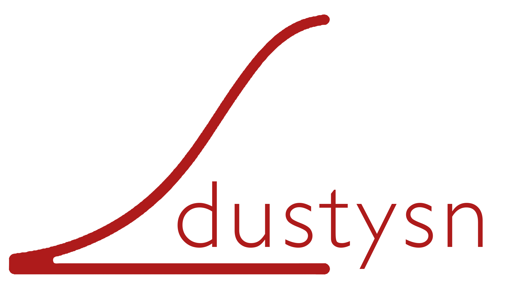

   
Is it nuclear?
==============

``dustysn`` is a Python package designed to fit the SEDs of SNe.

.. toctree::
   :maxdepth: 2
   :caption: User Guide

   installation
   usage
   methodology

Quick Start
-----------

To start do this::

    import dustysn

Key Features
------------

* Can fit silicates and carbonaceous dust

Requirements
------------

* Python 3.7 or later
* Having the ``emcee`` package installed

See :ref:`installation` for detailed setup instructions.

Citation
--------

If you use ``dustysn`` in your research, please cite [reference to be added].

License & Attribution
---------------------

Copyright 2024 Sebastian Gomez and `contributors <https://github.com/gmzsebastian/dustysn/graphs/contributors>`_.
``dustysn`` is free software made available under the MIT License.