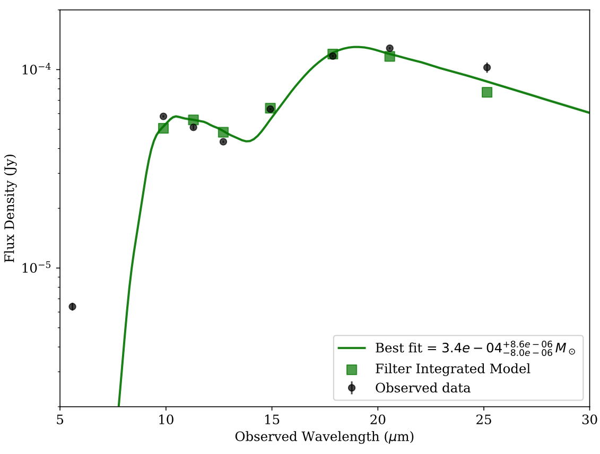
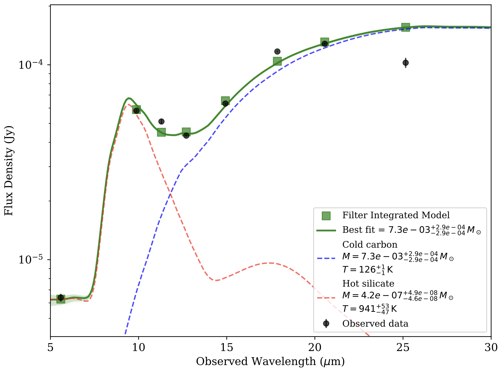

.. _usage:

Usage
=====

Basic Usage
-----------

This page provides a comprehensive guide on how to use ``dustysn`` to fit SEDs of supernovae using different dust emission models. 
The most basic function is ``calc_model_flux``, which generates a model dust emission spectrum.

.. code-block:: python

    from dustysn.model import calc_model_flux
    from astropy import units as u
    import matplotlib.pyplot as plt
    plt.rcParams.update({'font.size': 12})
    plt.rcParams.update({'font.family': 'serif'})

    # Basic parameters
    dust_mass = 0.0008  # Solar masses
    temperature = 158  # Kelvin
    redshift = 0.001605
    composition = 'silicate'  # 'carbon' or 'silicate'
    grain_size = 0.1  # microns

    # Wavelength grid (in microns)
    obs_wave = np.linspace(5, 30, 100) * u.micron

    # Calculate the model flux
    model_flux = calc_model_flux(obs_wave, dust_mass, temperature, redshift,
                                grain_size=grain_size, composition=composition)
                    
    # Plot the model
    plt.plot(obs_wave, model_flux, 'g')
    plt.xlabel(r'Observed Wavelength ($\mu$m)')
    plt.ylabel('Flux Density (Jy)')
    plt.yscale('log')
    plt.ylim(1e-6, 1e-3)
    plt.xlim(5, 30)

.. _example:

.. figure:: images/example1.png
   :alt: Example
   :align: center
   :width: 100%

   **Silicate dust model.** Simple example of a silicate SED model created with ``dustysn``.

Fitting Data
------------

In this page we will use SN2017eaw as an example using the data from `Shahbandeh et al. 2023 <https://ui.adsabs.harvard.edu/abs/2023MNRAS.523.6048S/abstract>`_.
First thing to do is to import the data, which has to be stored in a text file with a Flux, Flux error, UL (Upper Limit), Filter, Telescope, and Instrument columns.
If no Instrument or Telescope is provided, the function will assume that the data is from JWST MIRI. The data must be structured as follows:

.. list-table:: Input Data
   :header-rows: 1

   * - Flux
     - Flux_err
     - UL
     - Filter
     - Telescope
     - Instrument
   * - 6.39e-6
     - 2.9e-7
     - False
     - F560W
     - JWST
     - MIRI
   * - 5.812e-5
     - 7.9e-7
     - False
     - F1000W
     - JWST
     - MIRI
   * - 5.117e-5
     - 1.25e-6
     - False
     - F1130W
     - JWST
     - MIRI
   * - 4.33e-5
     - 5.8e-7
     - False
     - F1280W
     - JWST
     - MIRI
   * - 6.326e-5
     - 6.9e-7
     - False
     - F1500W
     - JWST
     - MIRI
   * - 1.17e-4
     - 1.28e-6
     - False
     - F1800W
     - JWST
     - MIRI
   * - 1.282e-4
     - 1.61e-6
     - False
     - F2100W
     - JWST
     - MIRI
   * - 1.0247e-4
     - 6.08e-6
     - False
     - F2550W
     - JWST
     - MIRI

The ``fit_dust_model`` is the main function used to fit the data, which uses MCMC to fit the dust emission model to the data.

.. code-block:: python

    from dustysn.model import import_data, fit_dust_model

    # Define the parameters of the model
    filename = 'SN2017eaw.txt' # File containing the data
    object_name = 'SN2017eaw' # Name of the object
    redshift = 0.001605 # Redshift of the object
    composition = 'silicate' # Composition of the dust ('silicate' or 'carbon')
    grain_size = 0.1 # Grain size in microns
    n_components = 1 # Number of dust components to fit (1 or 2)

    # Define the parameters of the fit
    n_steps = 200 # Number of steps in the MCMC fit
    n_walkers = 50 # Number of walkers in the MCMC fit
    n_cores = 6 # Number of parallel cores to use for the fit
    sigma_clip = 2 # Sigma clipping to remove outliers
    repeats = 2 # Number of times to repeat the fit

    # Import data
    obs_wave, obs_flux, obs_flux_err, obs_limits, obs_filters, obs_wave_filters, obs_trans_filters = import_data('SN2017eaw.txt')

    # Fit the model
    results_1 = fit_dust_model(obs_wave, obs_flux, obs_flux_err, obs_limits, redshift, object_name,
                               composition=composition, grain_size=grain_size, n_components=n_components, n_walkers=n_walkers,
                               n_steps=n_steps, n_cores=n_cores, sigma_clip=sigma_clip, repeats=repeats,
                               obs_wave_filters=obs_wave_filters, obs_trans_filters=obs_trans_filters,
                               plot=True, output_dir='.')

   **One Component Model Fit.** Example of a one component model fit to the data of SN2017eaw.

As can be seen here, the single component dust model does not ccurately fit the bluest data point. You can modify the ``fit_dust_model`` function to use two components,
or you can use the ``full_model`` function to run all basic functions, including a two component model fit.

.. code-block:: python

    from dustysn.model import full_model

    # Define the parameters of the model
    filename = 'SN2017eaw.txt' # File containing the data
    object_name = 'SN2017eaw' # Name of the object
    redshift = 0.001605 # Redshift of the object
    composition = 'silicate' # Composition of the dust ('silicate' or 'carbon')
    grain_size = 0.1 # Grain size in microns

    # Define the parameters of the fit
    n_steps = 200 # Number of steps in the MCMC fit
    n_walkers = 50 # Number of walkers in the MCMC fit
    n_cores = 6 # Number of parallel cores to use for the fit
    sigma_clip = 2 # Sigma clipping to remove outliers
    repeats = 2 # Number of times to repeat the fit

    # Fit the model
    full_model(filename, object_name, redshift, n_steps, n_walkers, composition=composition,
               grain_size=grain_size, n_cores=n_cores, sigma_clip=sigma_clip, repeats=repeats,
               plot=True, output_dir='.')

.. figure:: images/SN2017eaw_2_model_fit.png
   :alt: 2 Component Model Fit
   :align: center
   :width: 100%

   **Two Component Model Fit.** Example of a two component model fit to the data of SN2017eaw.

That is a better fit to the data, but how do we know that? The ``full_model`` function also generates a comparsion plot in which it compares the two models
using the Bayesian Information Criterion (BIC) and the Akaike Information Criterion (AIC). The higher the value from difference between the two value, the 
more prefereed the two component model is.

.. figure:: images/comparison_SN2017eaw.png
   :alt: BIC and AIC Comparison
   :align: center
   :width: 100%

   **BIC and AIC Comparison.** Example of a BIC and AIC comparison between the one and two component model fit to the data of SN2017eaw.

In this case, the two component model is preferred over the one component model.

Different Compositions
~~~~~~~~~~~~~~~~~~~~~~

Additionally, you can use the ``composition_hot`` and  ``composition_cold`` keys to specify separate compositions for the hot and cold dust components, respectively.
Right now, both must have the same grain size. To do this, you can modify the ``fit_dust_model`` or ``full_model`` functions like this:

.. code-block:: python

    # Fit the two component model
    results_2 = fit_dust_model(obs_wave, obs_flux, obs_flux_err, obs_limits, redshift, object_name, grain_size=grain_size,
                               n_components=n_components, n_walkers=n_walkers, n_steps=n_steps, n_cores=n_cores,
                               sigma_clip=sigma_clip, repeats=repeats, obs_wave_filters=obs_wave_filters,
                               obs_trans_filters=obs_trans_filters, plot=True, output_dir='.',
                               composition_hot='silicate', composition_cold='carbon')

    # Run all model functions
    full_model(filename, object_name, redshift, n_steps, n_walkers, grain_size=grain_size,
               n_cores=n_cores, sigma_clip=sigma_clip, repeats=repeats, plot=True, output_dir='.',
               composition_hot='silicate', composition_cold='carbon')

   **Two Component Model Fit.** Example of a two component model fit to the data of SN2017eaw, but with two different compositions for the hot and cold dust components.

In this case, this is not a great fit.

Optically Thick Case
~~~~~~~~~~~~~~~~~~~~

You can also choose to fit optically thick dust by specifying ``dust_type = 'thick'``, you just need to also specify
a radius in cm for the dust shell. All the other parameters are the same as before.

.. code-block:: python

    # Fit the two component model of optically thick dust
    results_2 = fit_dust_model(obs_wave, obs_flux, obs_flux_err, obs_limits, redshift, object_name, grain_size=grain_size,
                               n_components=n_components, n_walkers=n_walkers, n_steps=n_steps, n_cores=n_cores,
                               sigma_clip=sigma_clip, repeats=repeats, obs_wave_filters=obs_wave_filters,
                               obs_trans_filters=obs_trans_filters, plot=True, output_dir='.',
                               dust_type='thick', radius=1e16)
