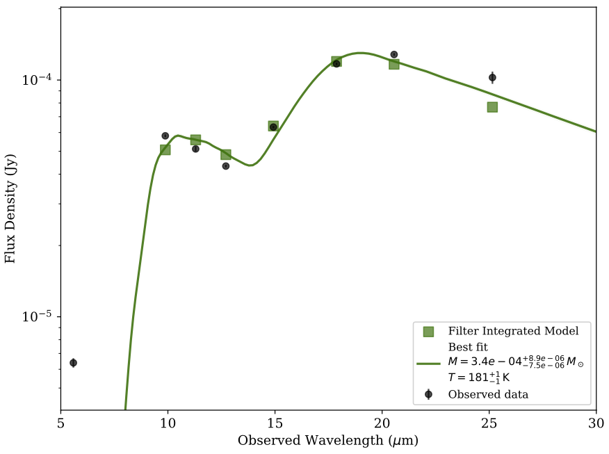
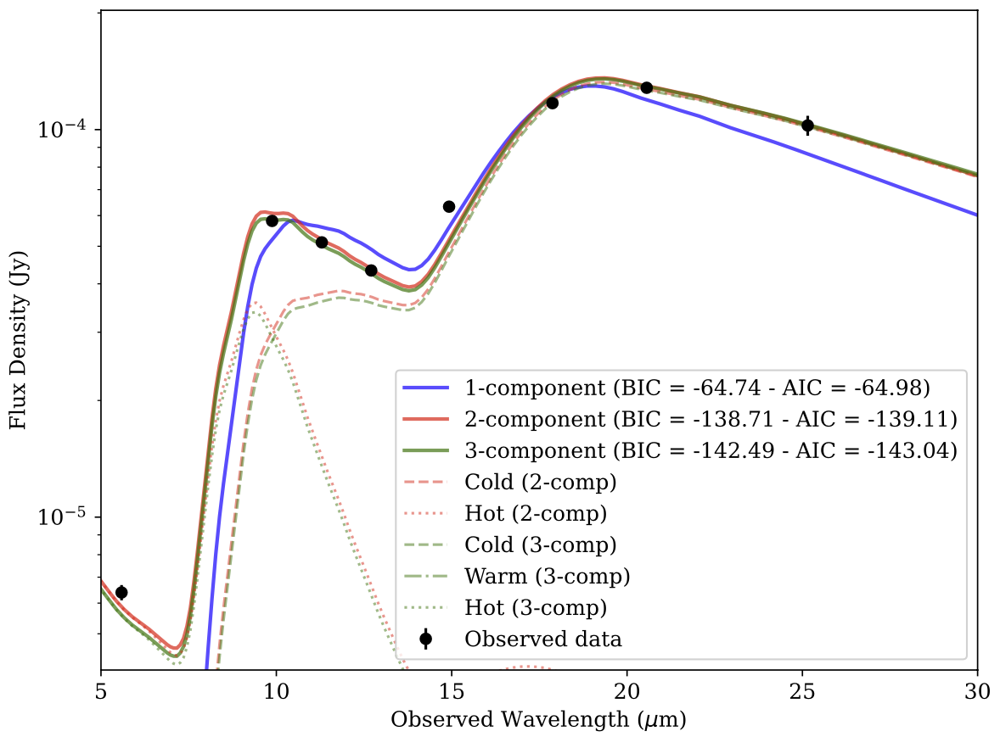

.. _usage:

Usage
=====

Basic Usage
-----------

This page provides a comprehensive guide on how to use ``dustysn`` to fit SEDs of supernovae using different dust emission models. 
The most basic function is ``calc_model_flux``, which generates a model dust emission spectrum.

.. code-block:: python

    from dustysn.model import calc_model_flux
    from astropy import units as u
    import numpy as np
    import matplotlib.pyplot as plt
    plt.rcParams.update({'font.size': 12})
    plt.rcParams.update({'font.family': 'serif'})

    # Basic parameters
    dust_mass = 0.0008  # Solar masses
    temperature = 158  # Kelvin
    redshift = 0.001605
    composition = 'silicate'  # 'carbon' or 'silicate'
    grain_size = 0.1  # microns

    # Wavelength grid (in microns)
    obs_wave = np.linspace(5, 30, 100) * u.micron

    # Calculate the model flux
    model_flux = calc_model_flux(obs_wave, dust_mass, temperature, redshift,
                                 grain_size=grain_size, composition=composition)
                    
    # Plot the model
    plt.plot(obs_wave, model_flux, 'g')
    plt.xlabel(r'Observed Wavelength ($\mu$m)')
    plt.ylabel('Flux Density (Jy)')
    plt.yscale('log')
    plt.ylim(1e-6, 1e-3)
    plt.xlim(5, 30)

.. _example:

   **Silicate dust model.** Simple example of a silicate SED model created with ``dustysn``.

Fitting Data
------------

In this page we will use SN2017eaw as an example using the data from `Shahbandeh et al. 2023 <https://ui.adsabs.harvard.edu/abs/2023MNRAS.523.6048S/abstract>`_.
First thing to do is to import the data, which has to be stored in a text file with a flux, flux error, upper limit, filter, telescope, and instrument columns
in the format specified below. If no instrument or telescope is provided, the function will assume that the data is from JWST MIRI.
The data must be structured as follows:

.. list-table:: Input Data
   :header-rows: 1

   * - Flux
     - Flux_err
     - UL
     - Filter
     - Telescope
     - Instrument
   * - 6.39e-6
     - 2.9e-7
     - False
     - F560W
     - JWST
     - MIRI
   * - 5.812e-5
     - 7.9e-7
     - False
     - F1000W
     - JWST
     - MIRI
   * - 5.117e-5
     - 1.25e-6
     - False
     - F1130W
     - JWST
     - MIRI
   * - 4.33e-5
     - 5.8e-7
     - False
     - F1280W
     - JWST
     - MIRI
   * - 6.326e-5
     - 6.9e-7
     - False
     - F1500W
     - JWST
     - MIRI
   * - 1.17e-4
     - 1.28e-6
     - False
     - F1800W
     - JWST
     - MIRI
   * - 1.282e-4
     - 1.61e-6
     - False
     - F2100W
     - JWST
     - MIRI
   * - 1.0247e-4
     - 6.08e-6
     - False
     - F2550W
     - JWST
     - MIRI

The ``fit_dust_model`` is the main function used to fit the data, which uses MCMC to fit the dust emission model to the data.

.. code-block:: python

    from dustysn.model import import_data, fit_dust_model

    # Define the parameters of the model
    filename = 'SN2017eaw.txt' # File containing the data
    object_name = 'SN2017eaw' # Name of the object
    redshift = 0.001605 # Redshift of the object
    composition = 'silicate' # Composition of the dust ('silicate' or 'carbon')
    grain_size = 0.1 # Grain size in microns
    n_components = 1 # Number of dust components to fit (1 or 2)

    # Define the parameters of the fit
    n_steps = 400 # Number of steps in the MCMC fit
    n_walkers = 50 # Number of walkers in the MCMC fit
    n_cores = 6 # Number of parallel cores to use for the fit
    sigma_clip = 2 # Sigma clipping to remove outliers
    repeats = 2 # Number of times to repeat the fit

    # Import data
    obs_wave, obs_flux, obs_flux_err, obs_limits, obs_filters, obs_wave_filters, obs_trans_filters = import_data('SN2017eaw.txt')

    # Fit the model
    results_1 = fit_dust_model(obs_wave, obs_flux, obs_flux_err, obs_limits, redshift, object_name,
                              composition=composition, grain_size=grain_size, n_components=n_components, n_walkers=n_walkers,
                              n_steps=n_steps, n_cores=n_cores, sigma_clip=sigma_clip, repeats=repeats,
                              obs_wave_filters=obs_wave_filters, obs_trans_filters=obs_trans_filters,
                              plot=True, output_dir='.', add_sigma=False)

   **One Component Model Fit.** Example of a one component model fit to the data of SN2017eaw, without additional variance.

As you can see there are a couple of problems with this model. First, the single dust model does not accurately fit the bluest data point.
Second, the model appears very tightly constrained with very small error bars, which is not realistic. To solve the second problem we can introduce
and additional variance to the model by setting the ``add_sigma`` parameter to ``True`` in the ``fit_dust_model`` function. This parameter will account
for an underestimation of the flux errors.

.. code-block:: python

    # Import data
    obs_wave, obs_flux, obs_flux_err, obs_limits, obs_filters, obs_wave_filters, obs_trans_filters = import_data('SN2017eaw.txt')

    # Fit the model
    results_1 = fit_dust_model(obs_wave, obs_flux, obs_flux_err, obs_limits, redshift, object_name,
                              composition=composition, grain_size=grain_size, n_components=n_components, n_walkers=n_walkers,
                              n_steps=n_steps, n_cores=n_cores, sigma_clip=sigma_clip, repeats=repeats,
                              obs_wave_filters=obs_wave_filters, obs_trans_filters=obs_trans_filters,
                              plot=True, output_dir='.', add_sigma=True)

   **One Component Model Fit.** Example of a one component model fit to the data of SN2017eaw, with additional variance ``sigma`` denoted by the orange dashed lines.

Now the model spread is more realistic. The ``emcee`` package in ``dustysn`` takes in a few parameters to run which depend on your specific system. The first are
the number of steps and walkers ``n_steps`` and ``n_walkers``, the higher the number the more likely the model will converge to a good fit, but it will also take longer to run.
``dustysn`` then takes an additional ``sigma_clip`` and ``repeats`` parameters, which are used to remove outliers from the data and repeat the fit multiple times to speed up convergence.
Below we show an example of a trace plot of the MCMC fit, which shows the evolution of the parameters during the fit. Additionally, the plot reports the R-hat statistic, which is a measure of convergence of the MCMC chains.
This is called the `Gelman-Rubin statistic <https://en.wikipedia.org/wiki/Gelman-Rubin_statistic>`_, and it should be close to 1 for a well-converged chain. If it is significantly larger than 1, it indicates that the chains have not converged yet.

   **Trace Plot for cold dust mass.** Example of a trace plot for the cold dust mass parameter during the MCMC fit with ``repeats=2``. It is clear from the figure that mid way through the fit, the chains get re-sampled.

Now that we have addressed the error bar problem, we are still left with the problem of the model not fitting the bluest data point. To solve this we will add an additional dust component to the model.
To do this, we can simply change the ``n_components`` parameter to 2 in the ``fit_dust_model`` function. You can specify different compositions for the hot and cold dust components, using the
``composition_hot`` and ``composition_cold`` parameters, respectively. For now, grain size must be the same for both components, but you can change it in the ``grain_size`` parameter.

.. code-block:: python

    from dustysn.model import import_data, fit_dust_model

    # Define the parameters of the model
    filename = 'SN2017eaw.txt' # File containing the data
    object_name = 'SN2017eaw' # Name of the object
    redshift = 0.001605 # Redshift of the object
    composition = 'silicate' # Composition of the dust ('silicate' or 'carbon')
    grain_size = 0.1 # Grain size in microns
    n_components = 2 # Number of dust components to fit (1 or 2)

    # Define the parameters of the fit
    n_steps = 600 # Number of steps in the MCMC fit
    n_walkers = 50 # Number of walkers in the MCMC fit
    n_cores = 6 # Number of parallel cores to use for the fit
    sigma_clip = 2 # Sigma clipping to remove outliers
    repeats = 3 # Number of times to repeat the fit

    # Import data
    obs_wave, obs_flux, obs_flux_err, obs_limits, obs_filters, obs_wave_filters, obs_trans_filters = import_data('SN2017eaw.txt')

    # Fit the model
    results_1 = fit_dust_model(obs_wave, obs_flux, obs_flux_err, obs_limits, redshift, object_name,
                              composition_hot=composition, composition_cold=composition, grain_size=grain_size,
                              n_components=n_components, n_walkers=n_walkers,
                              n_steps=n_steps, n_cores=n_cores, sigma_clip=sigma_clip, repeats=repeats,
                              obs_wave_filters=obs_wave_filters, obs_trans_filters=obs_trans_filters,
                              plot=True, output_dir='.', add_sigma=True)

.. figure:: images/SN2017eaw_2_model_fit.png
   :alt: 2 Component Model Fit
   :align: center
   :width: 100%

   **Two Component Model Fit.** Example of a model fit using a two component model to the data of SN2017eaw.

The code will also save a corner plot that can allow you to visualize the posterior distributions of the parameters and 
explore the correlations between them. This is useful to understand the uncertainties in the model parameters.

   **Corner Plot for Two Component Model Fit.** Example of a corner plot for the two component model fit to the data of SN2017eaw.

In this case it is also evident that the temperature of the hot dust component is not well constrained, but is instead hitting the prior of 3000K, which 
is chosen based on the photodissociation temperature of the dust. This means that the temperature of the hot component could be much higher, but that our
data is not able to constrain it.

That is a better fit to the data, but how do we know that? The ``full_model`` function also generates a comparsion plot in which it compares the one component
fit and the two component fit to the data, as well as the BIC and AIC values for both models. The BIC (Bayesian Information Criterion) and AIC (Akaike Information Criterion)
are both used to penalize models for their complexity, with lower values indicating a better fit.

   **BIC and AIC Comparison.** Example of a BIC and AIC comparison between the one, two, and three component model fit to the data of SN2017eaw.

In this case, the two component model is preferred over the one component model. Make sure to compare the *difference* between the BIC and AIC values,
as the absolute values depend on the number of data points and the number of parameters in the model. In this case the two component model is significantly
lower than the one component model, indicating that it is a better fit to the data. The three component model is only marginally better than the two component model,
but it is probably not worth the additional complexity.

Optically Thick Case
~~~~~~~~~~~~~~~~~~~~

You can also choose to fit optically thick dust by specifying ``dust_type = 'thick'``. In this case you must also
specify the radius of the dust shell in cm using the ``radius`` parameter. All the other parameters and functionality
are the same as before.
